# STRUCTURE – Organize content

STRUCTURE covers all aspects of organizing the content of reports and
presentations.

_Organizing the content_ means that reports and presentations follow a logical
structure forming a convincing storyline.

This chapter covers using consistent elements, building non-overlapping
elements, building collectively exhaustive elements, building hierarchical
structures, and visualizing their structure properly.

1. [Use consistent elements](#st-1-use-consistent-elements)
2. [Build non-overlapping elements](#st-2-build-non-overlapping-elements)
3. [Build collectively exhaustive
   elements](#st-3-build-collectively-exhaustive-elements)
4. [Build hierarchical structures](#st-4-build-hierarchical-structures)
5. [Visualize structure](#st-5-visualize-structure)

## ST 1 Use consistent elements

Listings and groupings of any kind of elements (items, terms, pictures, symbols,
etc.) used to organize content in charts, tables, and texts should contain
consistent elements only. This pertains for example to items, statements,
wordings, and the appearance of symbols and pictures.

## ST 1.1 Use consistent items

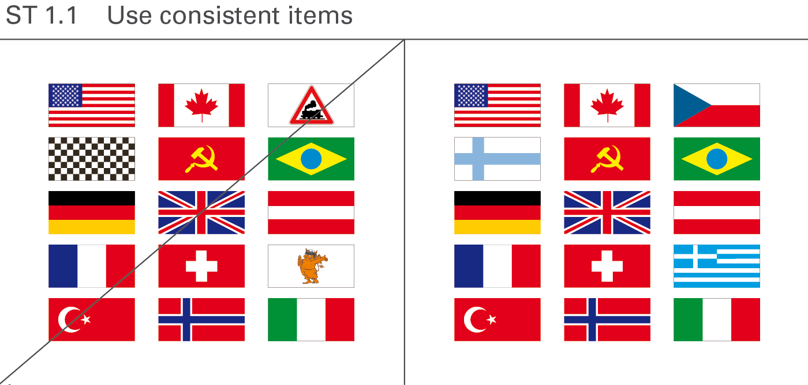

Items in a group should be of the same type, i.e. consistent. Consistent items
can be different types of cars, houses, traffic signs, or – as shown in Figure
ST 1.1, on the right hand side – different national flags representing the
corresponding nations. The left hand side of this figure includes other types of
items besides national flags, destroying the consistency.

## ST 1.2 Use consistent types of statements

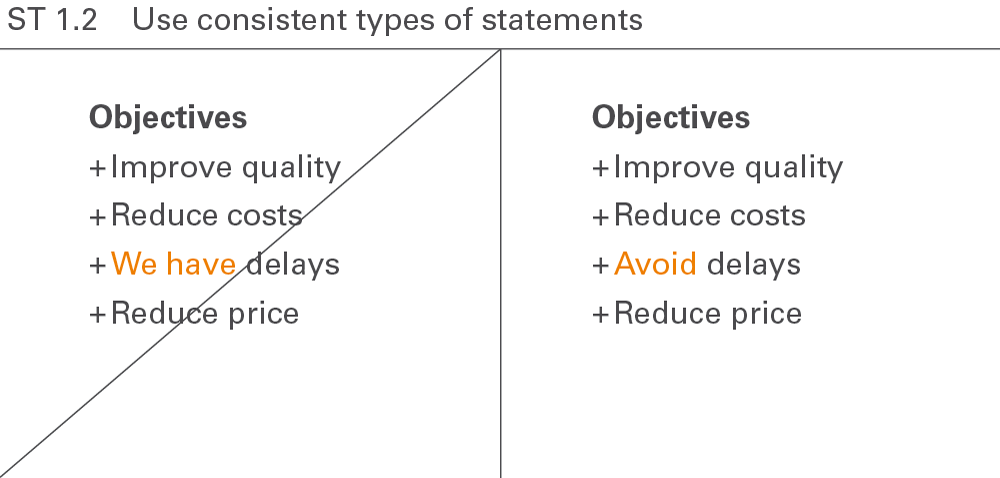

A list of statements will be easier to understand if all statements are of the
same type. The right hand side of Figure ST 1.2 shows four suggestions. By
contrast, on the left-hand side of this figure the third statement is a
detection, not a suggestion.

## ST 1.3 Use consistent wording

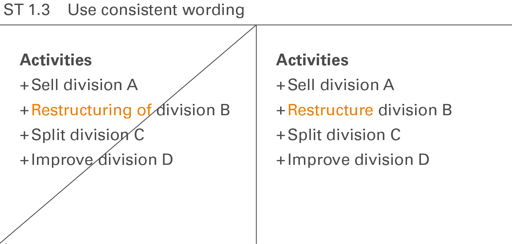

Structure all phrases – especially in listed arrangements – in a grammatically
consistent manner to facilitate quicker understanding. The right hand side of
Figure ST 1.3 shows a group of four consistent suggestions, an imperative verb
paired with a noun. By contrast, on the left hand side of this figure the second
suggestion uses verbal substantive instead of an imperative.

## ST 1.4 Use consistent visualizations

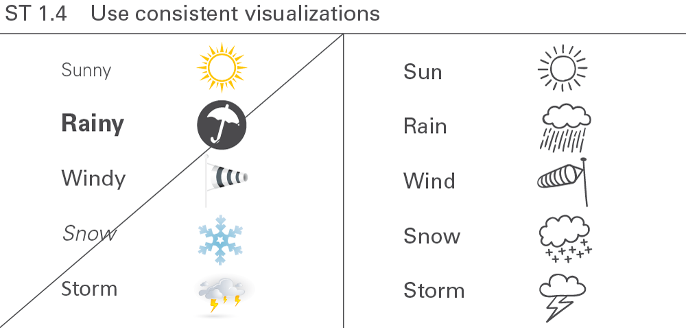

Visualizations such as symbols and pictures that are uniform in respect to their
layouts, colors, forms, fonts, etc. – especially in listed arrangements –
facilitate faster and easier comprehension.

## ST 2 Build non-overlapping elements

Elements belonging to a group should not overlap, i.e. they should be disjoint
or mutually exclusive. This concerns practical applications such as report
structures, business measures, or structure dimensions.

## ST 2.1 Build non-overlapping report structures

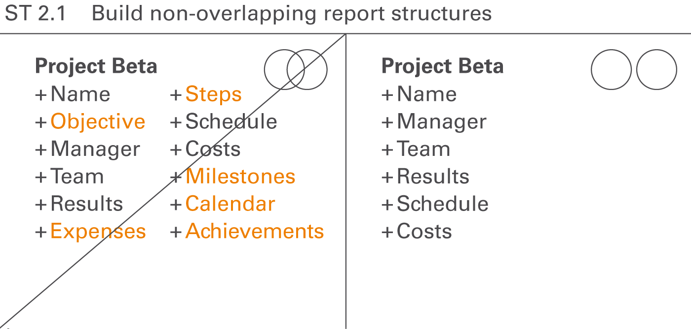

Structure reports and presentations in such a way that the parts, chapters,
sections, and paragraphs do not overlap. They should not cover the same aspects.

In Figure ST 2.1, on the left hand side, the following chapters of a project
description overlap:

-   expenses and costs
-   schedule, steps, milestones, and calendar
-   objective, results, and achievements

At first glance, the six terms on the right hand side of this figure have no
overlap in their logical structure. Of course, a relationship exists between the
_cost_, the _results_, and the _schedule_ of a project, but in regards to the
content of the chapters this is not an overlap.

## ST 2.2 Build non-overlapping business measures

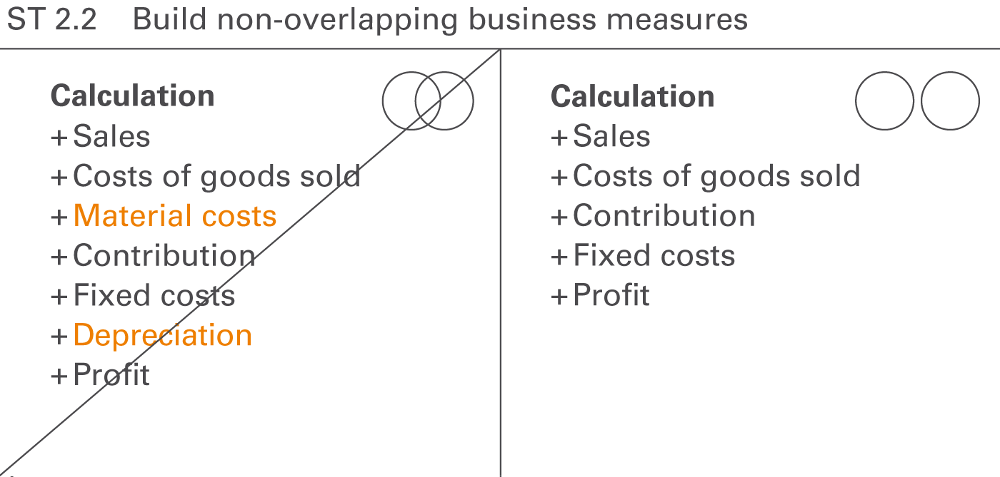

Structure a group of business measures in lists or calculations in a way they do
not overlap, i.e. business measures on one hierarchical level should be disjoint
or mutually exclusive.

Looking at Figure ST 2.2, on the left hand side, the following business measures
overlap

-   _material costs_ and _costs of goods sold_
-   _depreciation_ and _fixed costs_

The calculation scheme on the right hand side has been cleaned up.

## ST 2.3 Build non-overlapping structure dimensions

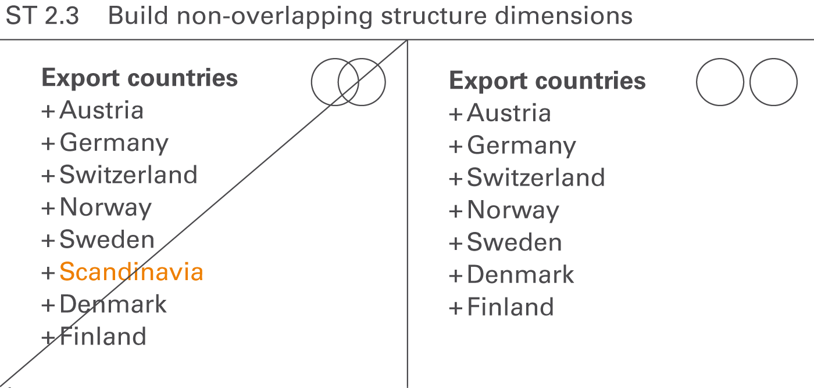

The elements of the _structure dimensions_ used in reports and presentations
should not overlap, i.e. the elements of a structure dimension should be
disjoint or mutually exclusive.

Looking at Figure ST 2.3 on the left hand side, the regions _Norway, Sweden,
Denmark,_ and _Finland_ overlap with _Scandinavia_.

## ST 3 Build collectively exhaustive elements

A list of elements is considered to be exhaustive when they cover all aspects of
a superordinate topic. For example, dividing _Europe_ into _Germany_, _Austria_,
_Switzerland_, and _Belgium_ is not exhaustive because other countries also
belong to Europe.

Structures with mutually exclusive (ME) and collectively exhaustive (CE)
elements are known as MECE structures.

## ST 3.1 Build exhaustive arguments

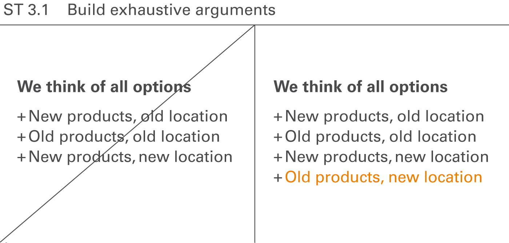

If some important arguments relating to a specific question are left out, the
given answer will not be convincing.

Looking at Figure ST 3.1 on the left hand side the option “_old products, new
location_” is missing.

## ST 3.2 Build exhaustive structures in charts and tables

The elements of structures presented in charts and tables should also be
exhaustive, in other words, adding up to one hundred percent.

In many practical applications of this kind, adding a remainder element (“rest
of...”) helps to conform to this rule.

## ST 4 Build hierarchical structures

Give reports and presentations a hierarchical structure whenever possible,
resulting in faster comprehension and simplified searching. These rules help to
write and present a good storyline.

## ST 4.1 Use deductive reasoning

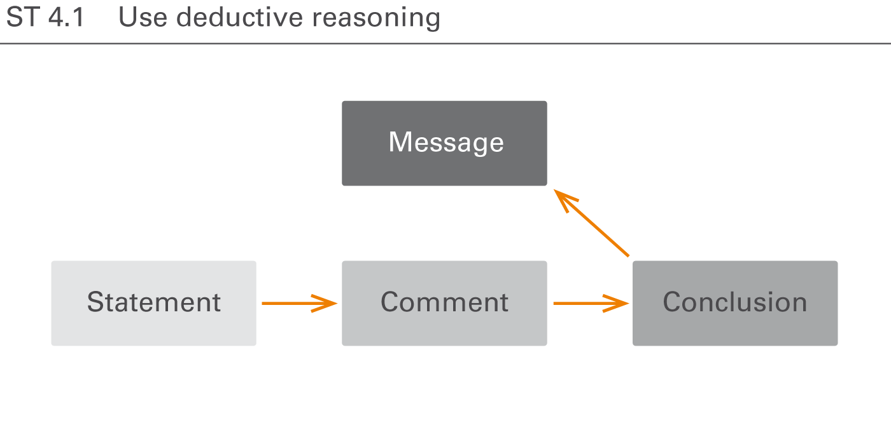

Exhibiting deductive reasoning (_logical flow_) for a given message aids in
_building_ hierarchical structures. _Logical flows_ always answer the question
“why” following the key message. They begin with a statement (all men are
mortal), continue with a comment (Socrates is a man), and resolve with a
conclusion (Socrates is mortal) culminating in the message (Socrates will die).

Deductive reasoning can be best applied in controversial discussions for arguing
and demonstrating need for action. However, it forces the readers or the
audience to reproduce the deduction and the whole argumentation can collapse if
any statements are questionable.

## ST 4.2 Use inductive reasoning

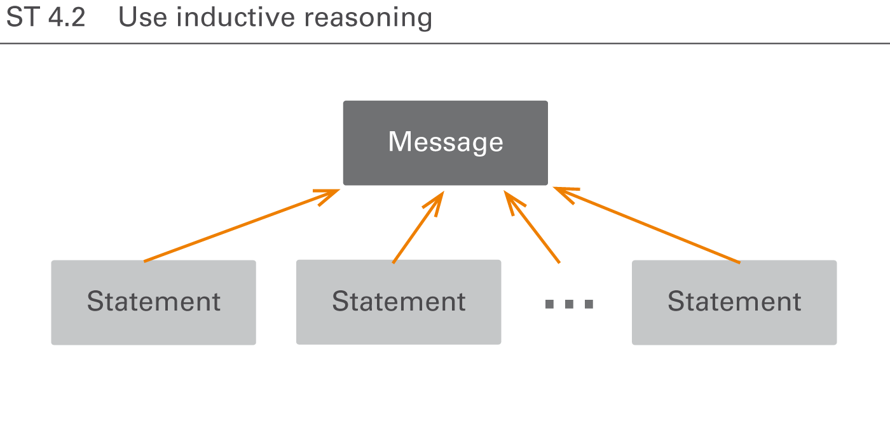

Exhibiting _inductive_ reasoning (_logical group_) for a given message aids in
understanding hierarchical structures. _Logical groups_ are homogenous,
non-overlapping, and collectively exhaustive arguments culminating in a message.
This results in a powerful argumentation that satisfies the addressees need for
an easily comprehensible logical structure.

## ST 5 Visualize structure

Having organized the arguments hierarchically, visualize this structure in order
to make the storyline transparent.

## ST 5.1 Visualize structure in reports

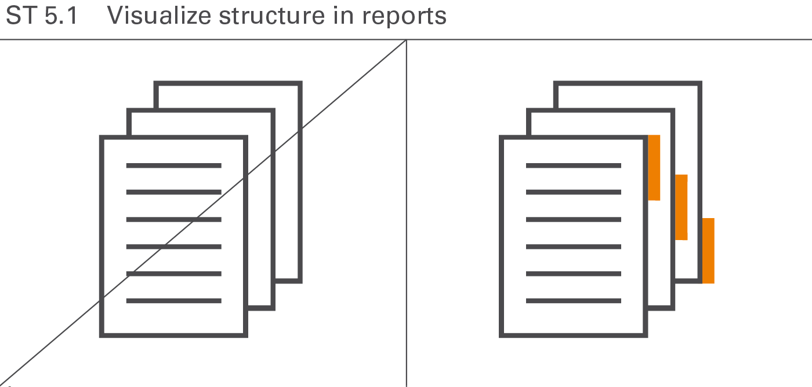

For easier understanding, underscore the logical structure of reports and
presentations with visual aids (e.g. outlines, dashboards, summaries). Figure ST
5.1 illustrates this rule showing binder tabs on the right hand side.

## ST 5.2 Visualize structure in tables

Design tables in such a manner that their hierarchical structure can be
recognized in both the columns as well as the rows.

The right hand side of Figure ST 5.2 shows three hierarchical levels of rows in
a table. The base level shows cities, the first summary shows regions, and the
second summary shows the country.

## ST 5.3 Visualize structure in notes

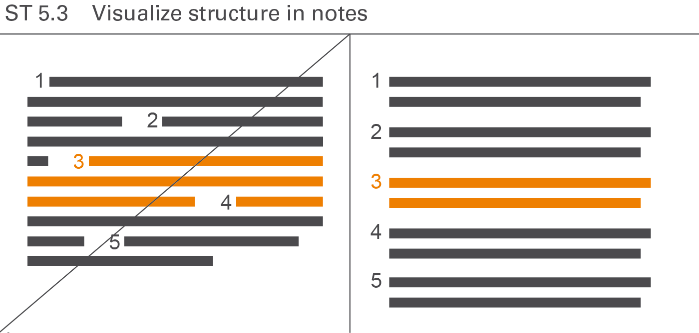

Notes are also easier to understand when their structure is shown clearly (see
Figure ST 5.3).

[← Convey a message](01-say.md) | [Choose proper visualization →](04-express.md)
