# CONDENSE – Increase information density

CONDENSE covers all aspects of increasing information density in reports and
presentations.

_Increasing information density_ means that all reports and presentations include
all information that is necessary to understand the respective message on one page.

This chapter covers using small components, utilizing space, as well as adding data,
elements, and objects.

1. [Use small components](#co-1-use-small-components)
2. [Maximize use of space](#co-2-maximize-use-of-space)
3. [Add data](#co-3-add-data)
4. [Add elements](#co-4-add-elements)
5. [Add objects](#co-5-add-objects)

## CO 1 Use small components

The need for a higher level of information density requires to display all
objects, elements, and signs as small as possible, while still being legible.
Different technical parameters apply to printed material, screen displays, and
projected slides.

## CO 1.1 Use small fonts

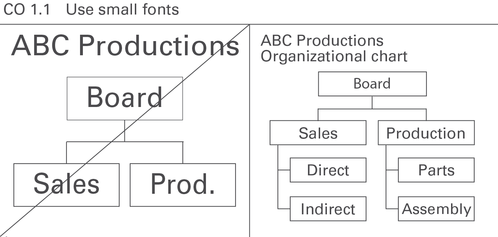

In general, avoid oversize fonts. They needlessly waste space,
see Figure CO 1.1.

## CO 1.2 Use small elements

Small elements increase clarity. Large-scale symbols and highlights are
not more suitable than smaller symbols and highlights, see Figure
CO 1.2.

## CO 1.3 Use small objects

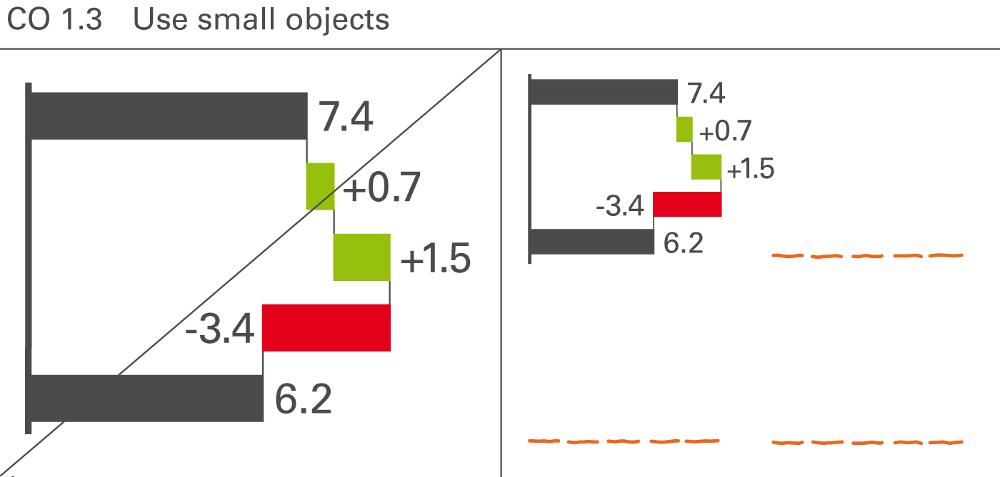

The size of charts and tables in reports and presentations should not be
as large as possible, rather as small as possible – yet only so small so
that the objects and all its details and labels can be read easily. This
provides room for more information and therefore better understanding of
the context, see Figure CO 1.3.

## CO 2 Maximize use of space

Utilizing free space is the fastest and easiest way to increase information
density. Make better use of needlessly wide margins and frames, or blank or
little used pages by filling them with helpful data pertaining to the context.

## CO 2.1 Use narrow page margins

The page layout is often dominated by corporate design standards not made
for high information density but for attractive design, sacrificing
valuable space to layout elements such as extra wide page margins,
see Figure CO 2.1.

## CO 2.2 Reduce empty space

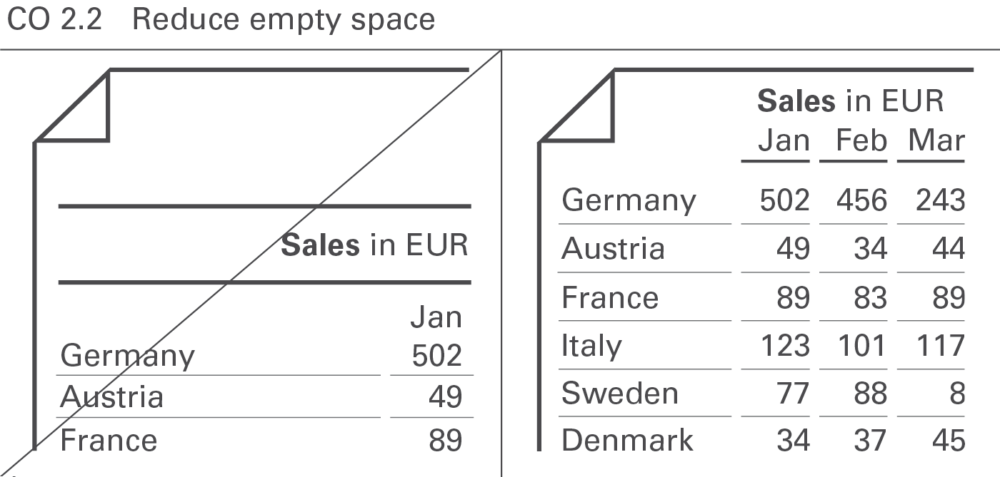

Reduce empty space to increase information density. This applies not only
to the page layout (see Figure CO 2.1) but
also to the layout of report objects such as charts and
tables (see Figure CO 2.2).

## CO 3 Add data

Adding more data to an existing visualization increases information density and
helps better understand the context.

## CO 3.1 Add data points

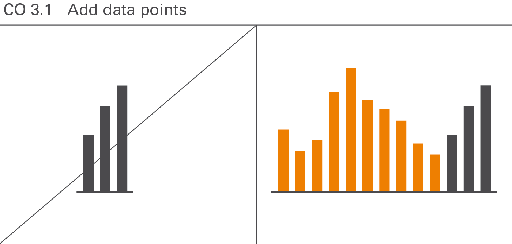

Displaying more data points does not jeopardize the comprehension of
numerical data. For example, a monthly statistic of staff numbers over
twelve months in a year would be understood just as quickly as for the
same data series with twelve months for each of the last three years –
in other words, a total of 36 data points instead of twelve. Usually,
interesting relationships are only detected with an increased number of
elements in a data series (see Figure CO 3.1).

## CO 3.2 Add dimensions

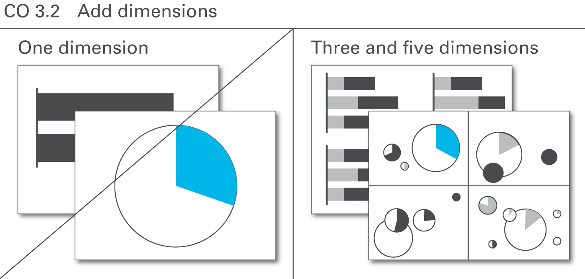

A very useful way to increase information density is to show more than
two dimensions of a business situation. A chart with only one dimension
(such as in a pie chart), visualizes only mundane things easily stated
in a simple sentence. Already charts with two dimensions can yield very
interesting relationships – yet those charts with three and more
dimensions yield structures leading to completely new insights (see
Figure CO 3.2).

## CO 4 Add elements

It is often appropriate to use two or more basic chart types (either horizontal
or vertical) to build _combined charts_ with a higher information
density. _Combined charts_ are treated as one entity as opposed to multiple charts. _Combined charts_ can be built both out from horizontal or vertical charts.

There are three types of combined charts depending on their type of combination:
_Overlay charts_, _multi-tier charts_, and _extended charts_. Additionally, chart elements can be embedded in tables and explanations can be integrated.

## CO 4.1 Show overlay charts

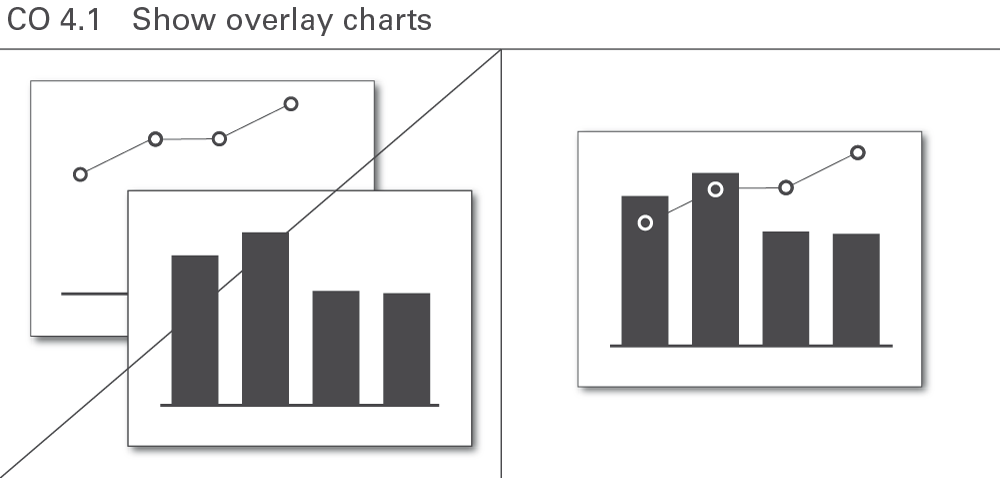

In an _overlay chart_, two or more basic charts overlap. These
overlapping charts always use the same category axis.

_Overlay charts_ can facilitate comprehension such as in the
combination of the development of sales (a series of columns) and the
return on sales in percent (a line). However, this approach can only be
used for a few chart combinations, see Figure CO 4.1.

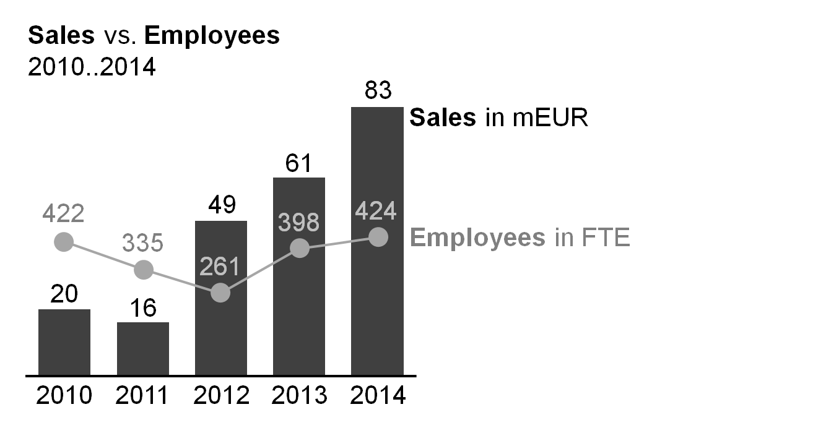

_Overlay charts_ frequently use different value axes. A _column chart_ representing a measure (e.g. sales) combined with a _line chart_ representing another measure (e.g. employees) is a typical example.

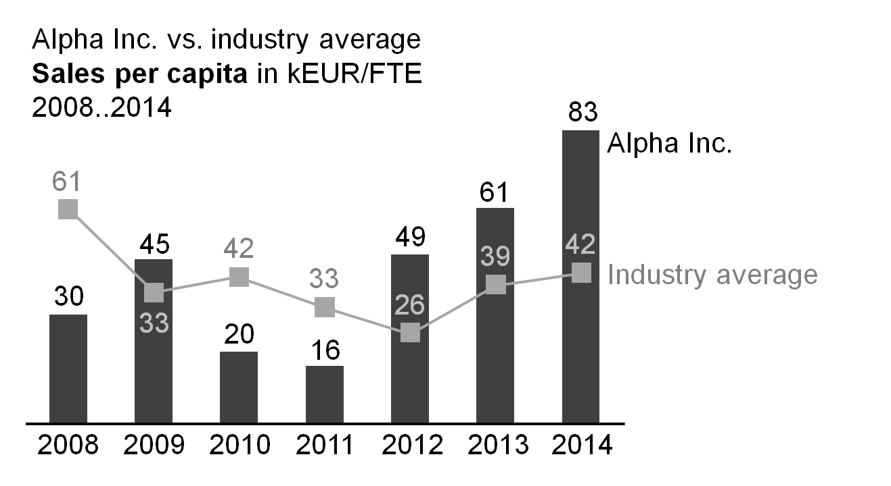

Sometimes, the same value axis is used as well. A _column chart_ representing a measure (e.g. sales) combined with a _line chart_ representing the same measure (e.g. industry average) is a typical example for such an _overlay chart_.

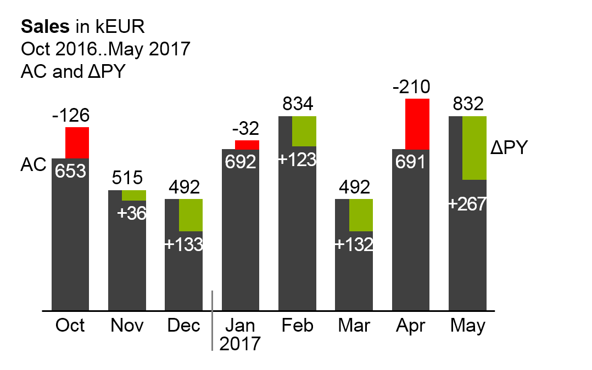

Column or bar charts with _integrated variances_ (variances displayed within the columns or bars) are other typical example for _overlay charts_ using the same value axis (see the last two figures).

Compared to two-tier charts, this presentation of two data series uses much less space. The disadvantages, though, are twofold: First, it is difficult to label the data of both the primary and secondary chart. Second, the development over time (horizontal axis) respectively the structure (vertical axis) of the primary chart is difficult to see.

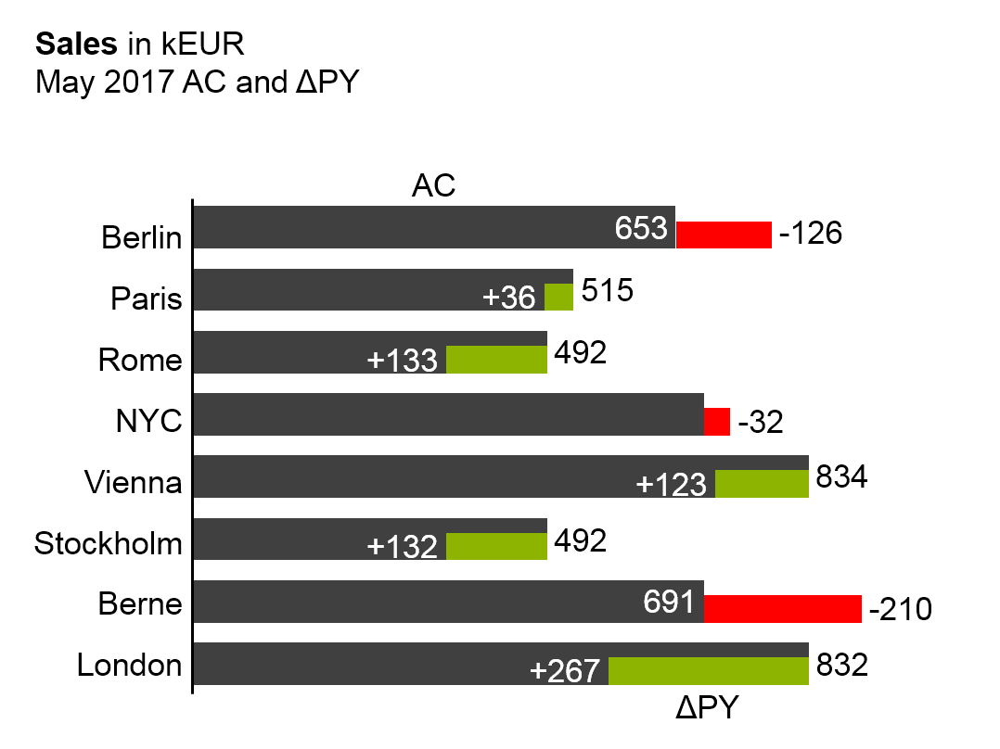

Suggestion: If there is enough space, use multi-tier charts instead.

## CO 4.2 Show multi-tier charts

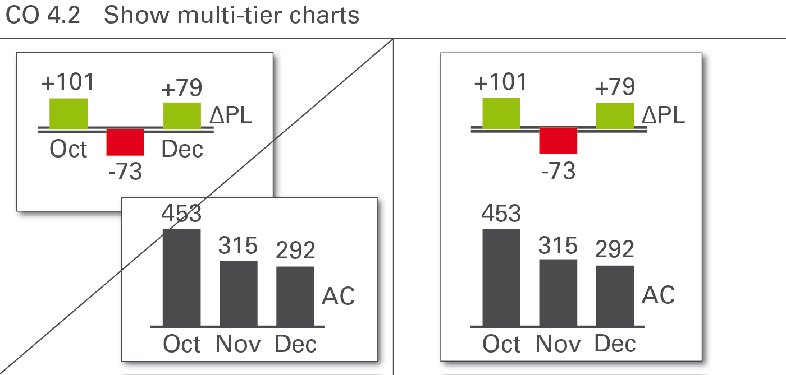

_Use multi-tier charts_ to increase information density by adding
additional tiers to the same category axis for analyses on the same
basic data. Multi-tier charts are most frequently used for displaying
variances along with the basic values, see Figure CO 4.2.

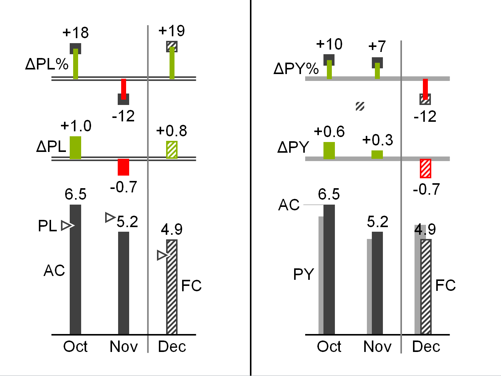

In a _two-tier chart_, a _secondary chart_ is shifted in parallel to the category axis of the _primary chart_. For horizontal charts the secondary chart appears above the primary chart, for vertical charts the secondary chart appears _to the right of_ the primary chart.

In both cases, the _category axes_ of the primary charts are
reduplicated in the secondary charts, usually having a different semantic
scenario design.

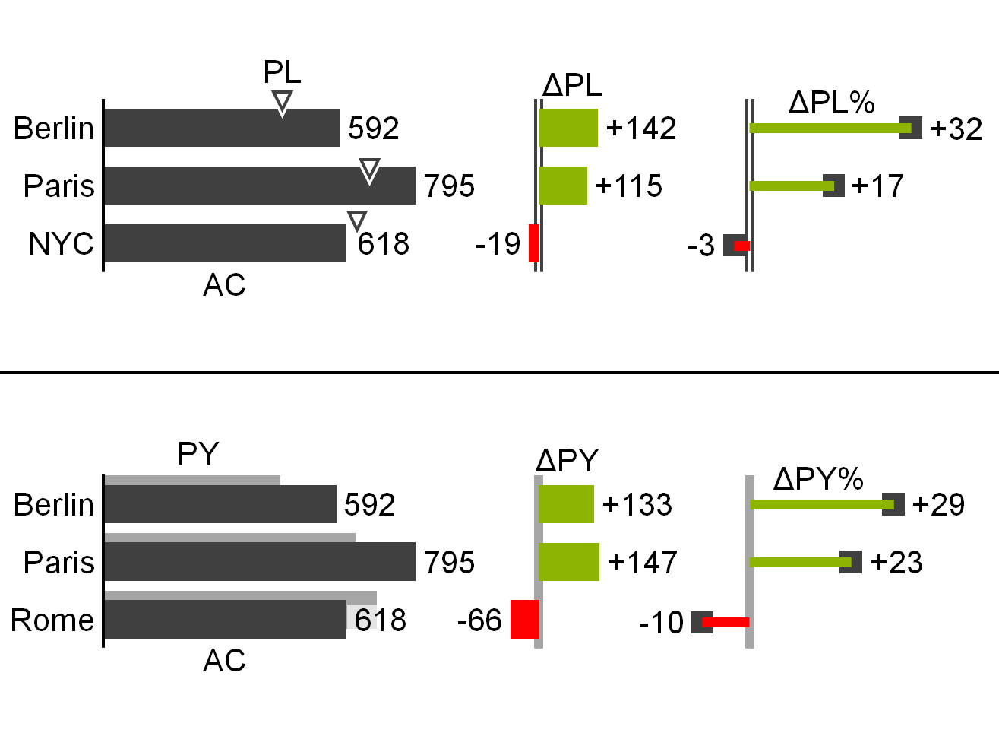

Both the primary and the secondary charts have their own value axes.
Value axes showing the same currency or the same physical unit should be
scaled identically.

In a _three-tier chart_ a third chart appears above a horizontal
or to the right of a vertical two-tier chart. In special cases, more
than three tiers can be combined.

Improve the interpretation of a primary chart showing grouped bars for
actual and plan data by adding variances. In the second and third
figure a secondary chart with absolute variances and a
tertiary pin chart with relative variances are combined.

## CO 4.3 Show extended charts

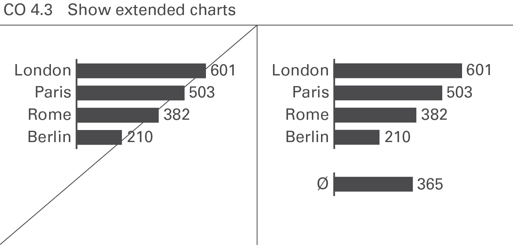

An _extended chart_, arranges additional charts _next_ to
the primary chart by virtually extending the category axis. This way of
increasing information density often is used when displaying context
information such as market averages or competitor figures, see Figure CO
4.3.

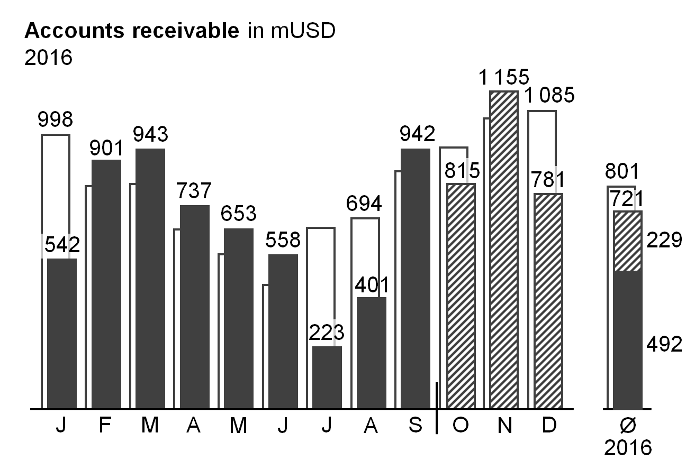

For horizontal charts, additional charts appear to the left or right of the primary chart, for vertical charts, above or below. In both cases, position the _category axes_ of the additional charts on a virtual extension of the category axes of the primary chart.

In an extended chart, use the same value axis for both the primary and
the additional charts.

Improve the interpretation of a primary chart by adding extended charts
showing the same values from a different perspective. In the figure on
the left, a secondary _grouped column chart_ at the right hand
side shows the monthly average.

## CO 4.4 Embed chart elements in tables

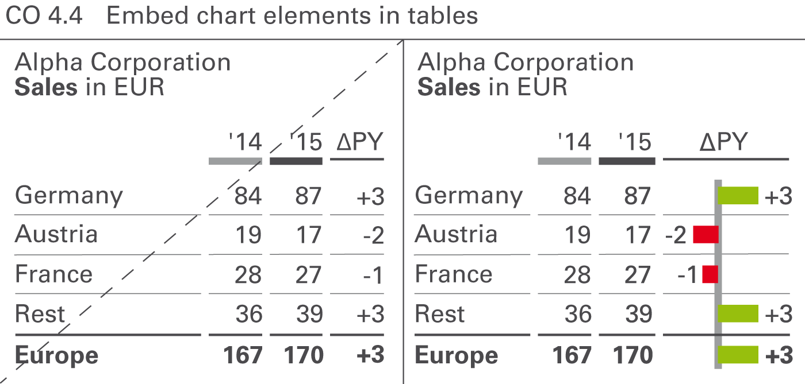

Increase the information density of tables by using _chart
elements_, see Figure CO 4.4. Bars, warning dots, sparklines,
and traffic lights are the predominant chart element types in tables.

**Table bars**

_Table bars_ are bar charts integrated into tables. The categories of these bar charts must correspond to the rows of a table. Both single bar charts with single bars or pins and waterfall bar charts are powerful means to visualize the absolute figures and variances in tables. Most recommendations concerning vertical chart types can be applied to _table bars_.

**Warning dots**

Not to be confused with _traffic lights, warning dots_ can
be a good solution in highlighting important negative, positive,
or questionable parts of a table. It is important to use only
very few warning dots in one table.

**Sparklines**

Omit _sparklines_ if not scaled properly. Individually
scaled sparklines can be misleading because small fluctuations
in a series of other small fluctuations look the same as big
fluctuations in a series of big fluctuations. However,
sparklines with proper scaling (e.g. indexed) can be helpful.

**Traffic lights**

_Traffic lights_ contain little information, as they
represent no more than three (red, green, yellow) states. Use
them only if there is no more information to be conveyed than
those two or three states (e.g. “yes” or “no”). In all other
cases, replace traffic lights with more suitable means of
representation, such as _table bars_.

## CO 4.5 Embed explanations

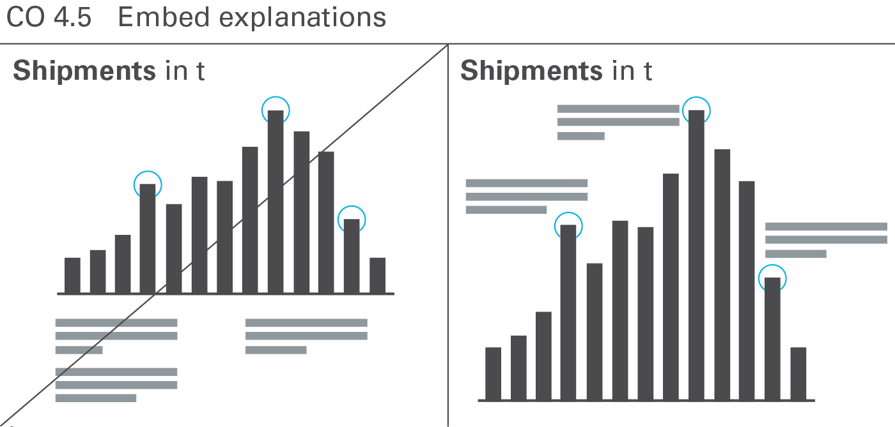

Both the density of information and the level of comprehension increase
when explanations are embedded into charts and tables (this applies to
written reports and handouts only). When the explanation refers directly
to the visual presentation in question, it helps to establish a
connection and speeds up comprehension, see Figure CO 4.5.

## CO 5 Add objects

Reports and presentation material consist of one or more _pages_. The
content of one page can be viewed together without referring to other content,
e.g. flipping to other pages.

Reports and presentation material often arrange more than one chart on one page.
While this increases information density and fosters a higher level of
comparability, it presents a design challenge: A uniform notation concept and
consistent scaling are even more important than on pages with single charts.

The most important types of pages with multiple objects are small multiples and
multi-charts (including _ratio trees_).

## CO 5.1 Show small multiples

Substantially improve the comprehension of complex relationships by
displaying charts of the same type and the same scale on the same page.
These charts are called _small multiples_, see Figure CO 5.1.

Typical applications are charts with different countries, products, or
projects placed next to each other. Of course, there is an upper limit
to the number of charts on one page, depending mainly on the page- and
font-size used.

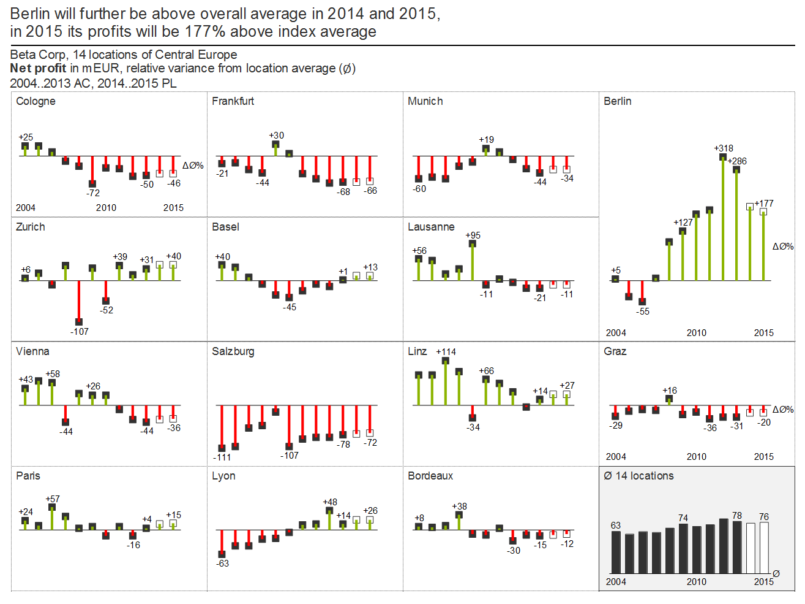

Showing _small multiples_ is a good way to compare a set of up to
around 25 charts. Instead of exceeding this number on one page, a new
chart called “Others” containing the accumulation of all other elements
could be a solution.

As mentioned in the chapter “CHECK – Ensure visual integrity”, all small multiples must use the identical scale.

Working with _small multiples_ can be difficult if certain charts
show significantly bigger values than others. Using a different scale
for a chart with bigger values is not a feasible option, increase the
size of this chart instead.

## CO 5.2 Show related charts on one page

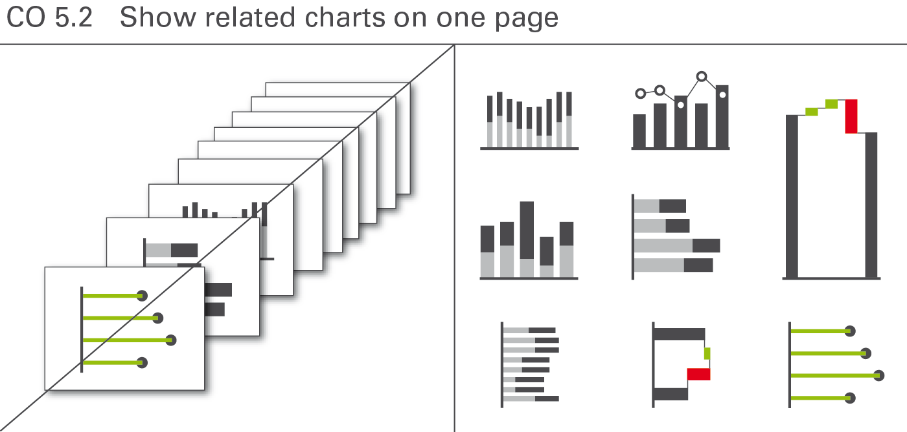

Different from small multiples, _related charts cover different topics (different measures) on one page._ They mostly use different scales, too. This arrangement of charts on one page is sometimes called _multi-charts_. But the term *multi-charts* fails to underline the fact that these charts must have a useful relationship. It does not make sense to arrange several, completely unrelated charts on one page.

This approach offers high data density and a higher level of
comparability – but it can be a demanding visual and technical challenge
as a uniform notation concept, clear terms, and an understandable
scaling prove even more important (see Figure CO 5.2).

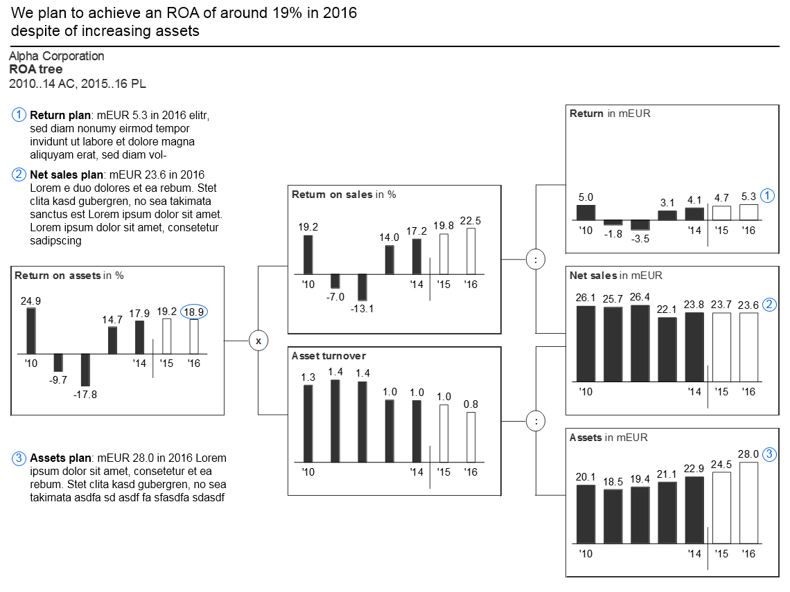

Consistent scaling of _multi-charts_ can be difficult. Sometimes different scales for the same unit or measure are inevitable. In this case, clearly indicate the use of a different scale by an appropriate mean, e.g. scaling indicators.

*Ratio trees* are multi-charts showing root causes. Use ratio
trees to prove or explain a specific issue. Pointing out the assumptions
and root causes of variances or temporal evolvements improves
understanding and is more convincing, too. In general, the
_ratio_ is broken down into its components (mostly from left to
right). Thus individual charts, preferably identical size, are arranged
in a tree shape structure.

Consistent scaling of _ratio trees_ can be difficult. Sometimes different scales for the same unit or measure are inevitable. In this case, clearly indicate the use of a different scale by an appropriate mean, e.g. scaling indicators.

A typical example of a page showing a _ratio tree_ is the “Return
on asset” tree.

## CO 5.3 Show chart-table combinations

Combining charts and tables on a page is not to be confused with the integration of chart elements in tables.

_Chart-table combinations_ cover situations where a separate chart is added to a page with a table or vice versa. In general, such a combination is very useful if both objects display supplementary data. Tables simply listing the numbers of a chart are superfluous in most cases (see also UN 2.3 “[Unify the position of legends and labels](09-unify.md#un-23-unify-the-position-of-legends-and-labels”).

## CO 5.4 Show charts and tables in text pages

Embedding illuminating charts and tables in the text of a written report
helps the reader understanding the message.

Always position charts and tables in close proximity to the phrase
carrying the message, which the chart or table supports.

Text pages should contain a title element like other pages. Also use a title – and, if possible, a message – for every chart and table embedded in a text page.

[← Avoid Clutter](05-simplify.md) | [Ensure visual integrity →](07-check.md)
