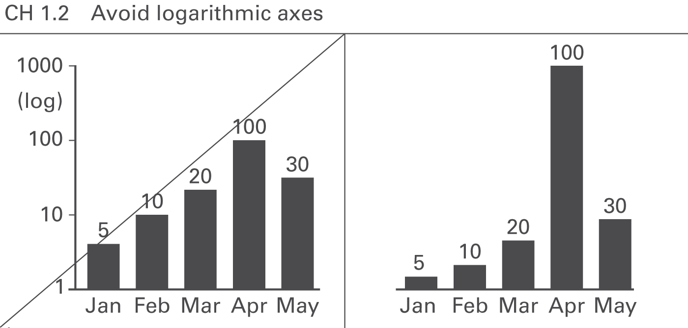
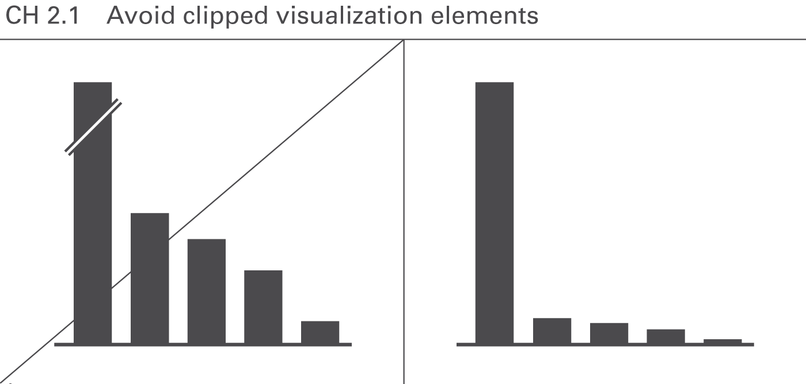
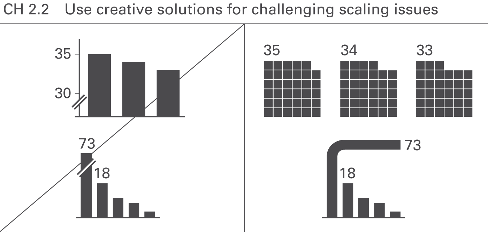
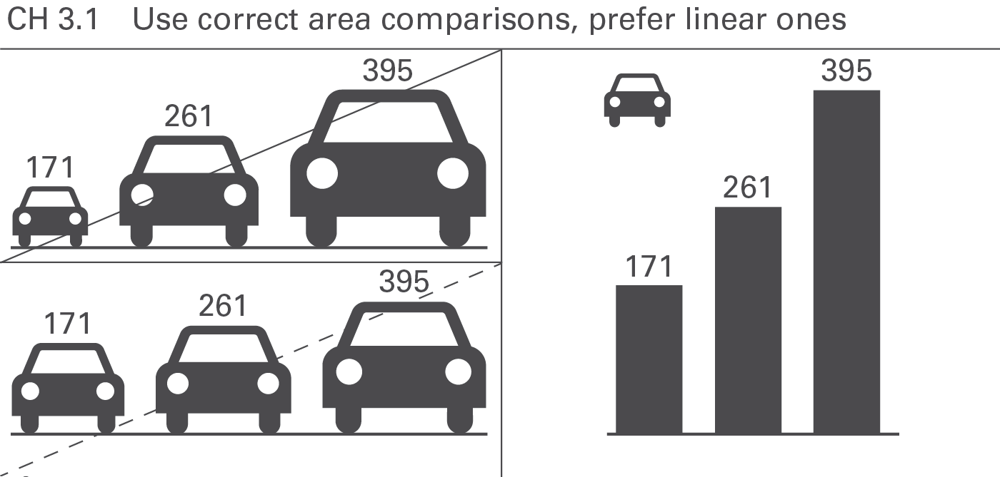
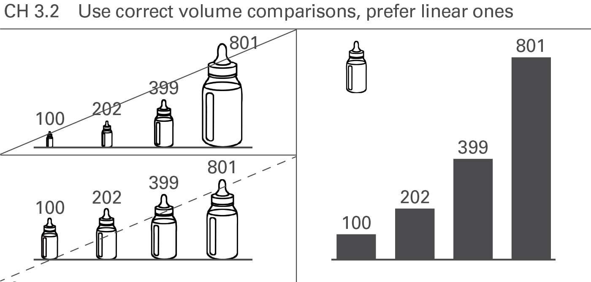
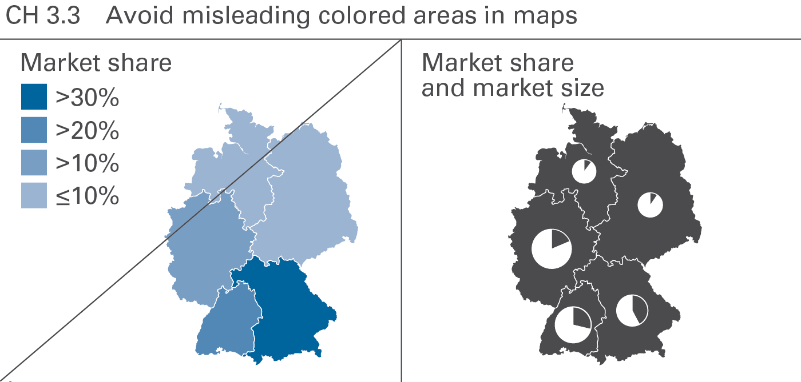
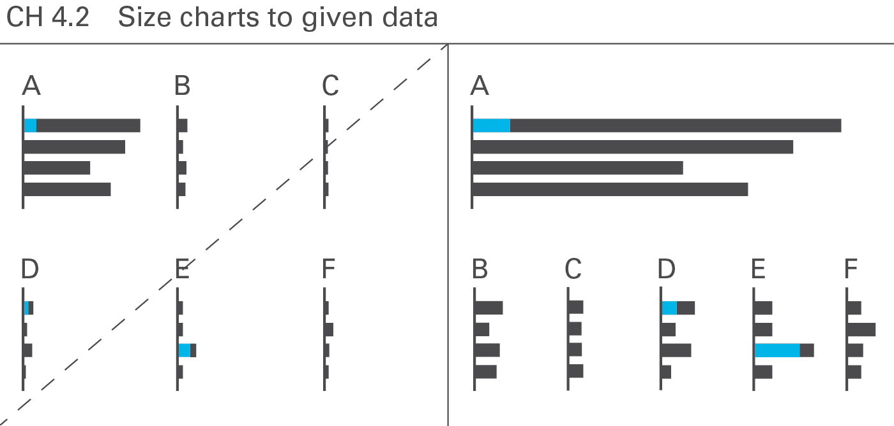
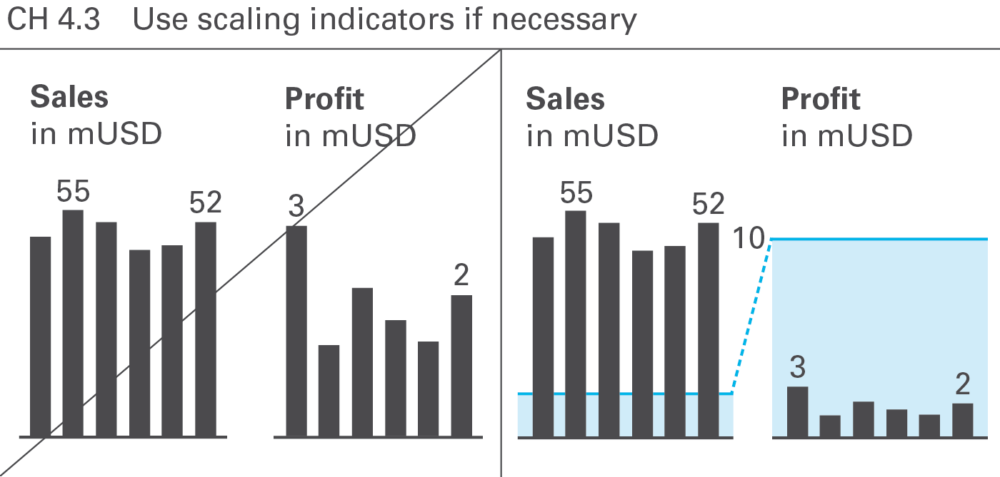
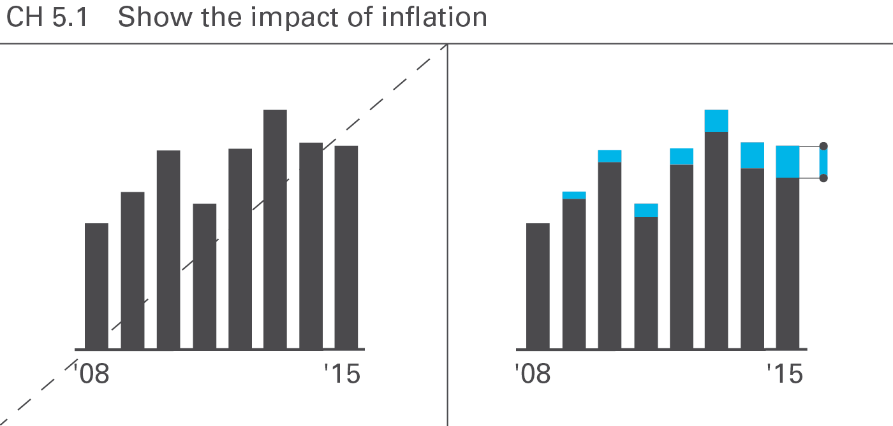
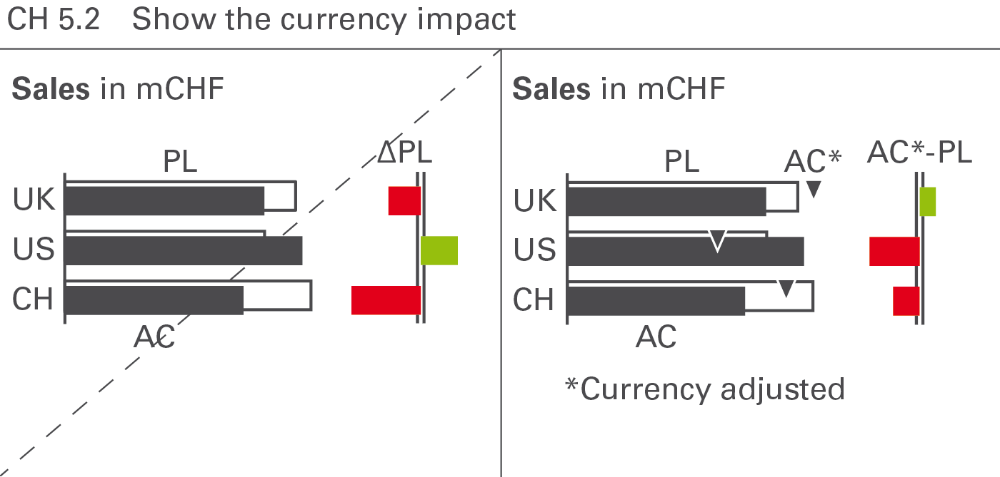

# CHECK – Ensure visual integrity

CHECK covers all aspects of ensuring visual integrity in reports and presentations.

_Ensuring visual integrity_ means that reports and presentations present
information in the most truthful and the most easily understood way by avoiding
misleading visuals.

This chapter covers avoiding manipulated axes and visualization elements, using the
same scales, and showing data adjustments.

1. [Avoid manipulated axes](#ch-1-avoid-manipulated-axes)
2. [Avoid manipulated visualization elements](#ch-2-avoid-manipulated-visualization-elements)
3. [Avoid misleading representations](#ch-3-avoid-misleading-representations)
4. [Use the same scales](#ch-4-use-the-same-scales)
5. [Show data adjustments](#ch-5-show-data-adjustments)

## CH 1 Avoid manipulated axes

Charts serve as a means to visually compare numerical values. Manipulated axes
defeat this purpose of explaining actual interrelations.

## CH 1.1 Avoid truncated axes

Charts with value axes not starting at zero (“cut” axes) are not “wrong”
in and of themselves, but the message to be visually conveyed then does
not correspond to the numerical values upon which the chart is based.
Therefore, value axes should generally start at zero, see Figure CH 1.1.

One exception to this rule exists: charts with indexed data (e.g. if the value for the index period is set to 100%) with only small variances from 100%. Here “zooming in” on the variances could be of greater value than indicating the absolute values (starting at zero). In this case, position the category labels at the 100% line in order to avoid misinterpretations.

## CH 1.2 Avoid logarithmic axes

_Avoid logarithmic scales_ because they do not allow the visual
comparison of values, see Figure CH 1.2. In business, very few
applications for logarithmic axes exist (e.g. comparing growth rates of
different stocks in percent).

## CH 1.3 Avoid different class sizes

If the categories represent ordered classes of elements (e.g. age
classes) as used for the visualization of distributions in histograms,
use class sizes of identical width (e.g. ten years). Otherwise, true
visual comparability is impossible, see Figure CH 1.3.

## CH 2 Avoid manipulated visualization elements

Displaying values differing by orders of magnitude can be challenging. Use
creative solutions instead of clipping visualization elements or cutting value
axes.

## CH 2.1 Avoid clipped visualization elements

Similar to “cut” axes, clipped visualization elements such as broken
columns make visual comparisons impossible, see Figure CH 2.1.

## CH 2.2 Use creative solutions for challenging scaling issues

Creative visualization elements can be used to compare extreme values,
e.g., displaying data in two-dimensional or even three-dimensional
visualization elements allows the comparison of values differing by
orders of magnitude, see Figure CH 2.2.

This rule must be clearly separated from the rules of section CH 3 “[Avoid misleading representations](07-check.md#ch-3-avoid-misleading-representations)” where area and volume visualizations are used improperly.

## CH 3 Avoid misleading representations

Graphical representations are misleading if the visual impression for the
observer differs from the underlying values.

## CH 3.1 Use correct area comparisons, prefer linear ones

Using two-dimensional representations (areas of circles, icons, or
emblems) for the visualization of data is only valid, if the size of
these areas corresponds to the underlying values. The visual perception
will be misleading if the diameters of circles or the heights of icons
represent the values, see Figure CH 3.1.

## CH 3.2 Use correct volume comparisons, prefer linear ones

Similar to areas, the visual perception will be misleading, if the
(one-dimensional) diameters or the (two-dimensional) areas of
three-dimensional visualization elements (spheres, cubes, etc.)
represent the values, see Figure CH 3.2. Even if their volumes represent
the values, it is hard to perceive them properly. Prefer linear
comparisons instead.

## CH 3.3 Avoid misleading colored areas in maps

Different colored areas can be helpful to visualize the precipitation per
square meter or the population density. However, do not use colored
areas for the visualization of non-area-related figures such as market
shares or return on sales. Position columns or bars of identical scale
in maps instead. By the way, pie charts also work well here (an
exception to the EX 2.1 “[Replace pie…”](04-express.md#ex-21-replace-pie-and-ring-charts) because they can be placed precisely at one point, like a
city (see Figure CH 3.3).

## CH 4 Use the same scales

Proper visual comparison requires the usage of identical scales for identical
measure units, or – if this is not possible – a clear indication of the
difference. If possible, use a consistent scaling concept for the complete
report or presentation material.

## CH 4.1 Use identical scale for the same unit

If presenting more than one chart of the same unit on one page, use the
identical scale for these charts, see Figure CH 4.1. In extreme
situations identical scales might not be desirable. In these exceptional
cases the use of scaling indicators (see [CH 4.3](07-check.md#ch-43-use-scaling-indicators-if-necessary)
and [UN 5.2](09-unify.md#un-52-unify-scaling-indicators)) can be helpful.

## CH 4.2 Size charts to given data

Using identical scales in multiple charts can be demanding if the values
in the charts differ by orders of magnitude. A good solution is adapting
the chart size to the given data, see Figure CH 4.2.

## CH 4.3 Use scaling indicators if necessary

There are several ways to overcome challenging scaling problems. _Scaling indicators_, such as *scaling lines* and *scaling areas* indicating the same numerical height (typically a power of 10) in all charts are helpful to assist in comparing multiple charts (of the same unit) with different scales, see Figure CH 4.3.

This guide suggests a _semantic design_ for scaling lines and scaling areas, see UN 5.2 “[Unify scaling indicators](09-unify.md#un-52-unify-scaling-indicators)”.

## CH 4.4 Use outlier indicators if necessary

Certain values that are very big in comparison to other values are called
outliers. If an outlier is not important for business, e.g. a big
relative variance of a small value, then it is not appropriate to scale
the whole chart to this outlier. Therefore, use _outlier
indicators_ for unimportant outliers, see Figure CH 4.4.

This guide suggests a _semantic design_ for outlier indicators, see UN 5.3 “[Unify outlier indicators](09-unify.md#un-53-unify-outlier-indicators)”.

## CH 4.5 Use magnifying glasses

Another way to assist in scaling problems is to use “_magnifying glasses_” for zooming in on a part of a chart with a bigger scale. Use an appropriate visualization element to mark the part of a chart to be zoomed in and to link it to a second chart displaying the zoomed part on a bigger scale.

## CH 5 Show data adjustments

For longer time series, currency and inflationary effects can bias the visual
impression, hiding the real development of business.

## CH 5.1 Show the impact of inflation

Making inflation effects transparent helps avoid misinterpretations of
time series visualizations, see Figure CH 5.1.

## CH 5.2 Show the currency impact

Similar to inflation effects, the adjustment of currency effects can help
to avoid misinterpretations, see Figure CH 5.2.

[← Increase information density](06-condense.md) | [Apply semantic notation →](09-unify.md)
